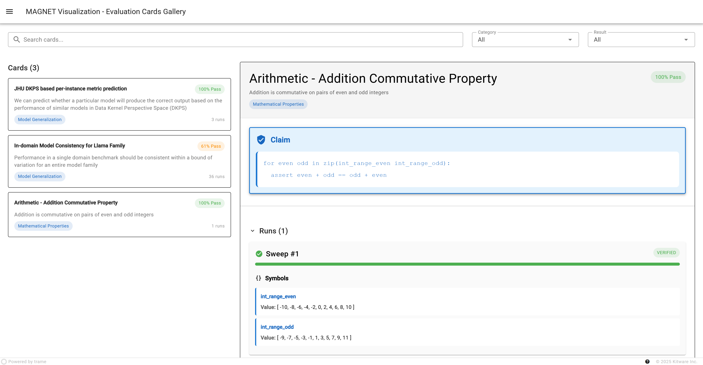
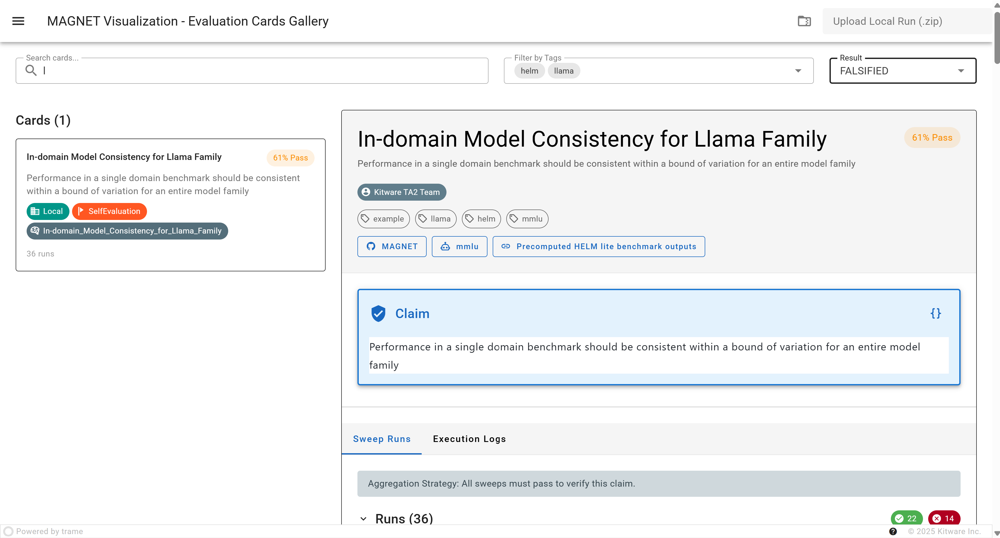
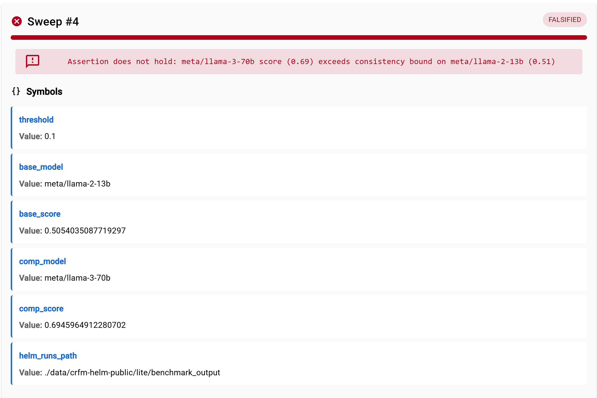
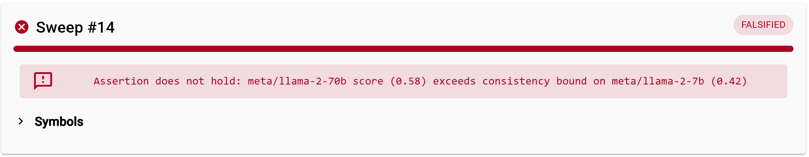

# MAGNET Evaluation Card Visualization Trame App
Lightweight static dashboard for visualizing Evaluation Cards and results generated by `aiq-magnet`.

## Quick Start (Local Results Only)
If your goal is to strictly view local results, you may start the application using the following steps:
1) Optional: Generate results
```
magnet evaluate /path/to/card
```
2) Prepare results

Note: Replace `evaluation_runs` if using a different results output path
```
# OPTION A: Modify results path to follow aiq-evaluations format

mkdir -p evaluations/SelfEvaluation/Local
mv evaluation_runs evaluations/SelfEvaluation/Local

--------------------------------------------------

# OPTION B: zip results and add later using the 'upload' UI

zip -r evaluation_runs.zip evaluation_runs
```
3) Clone this repo
```
git clone https://github.com/AIQ-Kitware/eval-card-viz.git
cd eval-card-viz
```
4) Run with minimal dependencies
```
# OPTION A

uv run visualization.py ../evaluations

--------------------------------------------------

# OPTION B: show example results and add zip using 'upload' button

uv run visualization.py ./evaluations
``` 


## General Guide

### (Preliminary) Populate Results 
From MAGNET, generate output artifacts by evaluating each card you would like to visualize. For example, you can use the `evaluate` command on our simple example card:
```
magnet evaluate magnet/cards/simple.yaml
```
The evaluation will automatically generate the directory structure below, creating a `card_hash` and `timestamp` for each `evaluate` call. 
```
./evaluation_runs
└── {card_hash}_{timestamp}
    ├── card.yaml
    |── results
    │   ├── {symbols_hash}
    │   │   └── verdict.json
    └── verdict.json                
```
Then, copy this output to a triple nested directory structure such as that in the [aiq-evaluations results repo](https://github.com/AIQ-Kitware/evaluations-example/).

The results should look like this:
```
./evaluations-example
├── SelfEvaluations
│   ├── Test
│   │   └── evaluation_runs
│   │       └── {card_hash}_{timestamp}
│   │           ├── card.yaml
│   │           ├── verdict.json
│   │           └── results
│   └── ...
└── ...
```

This visualization app expects a path argument that points to the root of this structure and contains all required artifacts: `/results`, `verdict.json`, and `card.yaml`.

### Install dependencies (create .venv)
This is an intentionally lightweight visualization tool with minimal dependencies. 
```bash
uv venv --python 3.11 --seed .venv-311-evalcard-viz
source .venv-311-evalcard-viz/bin/activate
uv pip install .
```
### Running the App
With results and environment ready, you can start the trame app and visualize your card runs.
```
python visualization.py ../evaluations-example/
```
### Adding data
While running the app (initialized with data or not), you may upload your own compressed local results using the button in the top right corner of the dashboard. The only accepted format is a zip of the native `magnet` output (e.g. `./evaluation_runs` above) with all expected components (`card.yaml`, `verdict.json`, `/results`). 

## App Features

### Dashboard
The visualization app populates a library of cards that can be selected to render on the right-side focused view.

A short catalog entry displays the title, description, submitter organization, submission milestone, algorithm, number of sweeps/runs, and verification rate. The focused view displays a markdown description of the card that can be toggled to show the raw python claim and aggregation strateg as well as parameter sweep results and logs.

<!-- Note: For this version, you may assume 100% Pass cards contain a VERIFIED claim, otherwise if the assertion banner rate is greater than the pass rate then the result is FALSIFIED. 
-->

### Search for cards
There are three fields available to search for particular cards: title, tags, and result.

As shown below, the Llama example card can be found by searching for its title in plain-text. However, the category and result fields could further narrow down particular cards. 


### Hide Details
Runs and symbols are both collapsable headings. You may click directly on 'Runs (X)' to hide all sweeps. Conversely, you may select the icon next to 'Symbols' to expose the symbol-value pairs for that sweep.

Using a falsified sweep for example,


And after hiding the details:



